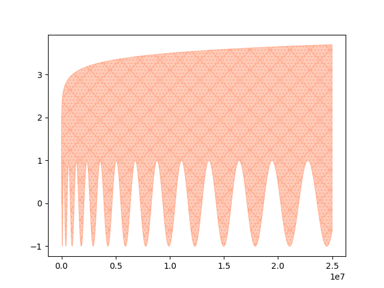

# Matplotlib.odin

This project binds Matplotlib library to the Odin language.

This is initial stage of the project and testing the idea on linux and python3.10. Other version of python and OS will be added later.

The idea is completely stolen from [lava/matplotlib-cpp](https://github.com/lava/matplotlib-cpp)

</img> </img> </img> </img> </img> </img> 

## Quick start

### Linux

Initialize venv:
```bash
PY_VER=3.10 make python
```

Source venv:
```bash
source venv3.10/bin/activate
```

Compile and run sample:
```bash
PY_VER=3.10 make all
PY_VER=3.10 make animation
./build/bin/animation
```

### Windows (MSVC)

Initialize venv:
```powershell
&"C:\Program Files\Python313\python.exe" -m venv venv313
```

Source venv and install requirements:
```powershell
.\venv313\Scripts\Activate.ps1
pip install -r .\requirements\requirements3.13.txt
```

Set `PYTHONPATH`:
```powershell
$env:PYTHONPATH = "venv313\Lib\site-packages"
```

Adjust [make_msvc.bat](make_msvc.bat) file by setting `PY_VER` to the required version, for example `SET PY_VER=313`. 

Build and run example:
```powershell
.\make_msvc.bat build_dirs
.\make_msvc.bat build
.\make_msvc.bat bar
.\build\bin\bar.exe
```

## References:
- https://docs.python.org/3.10/extending/embedding.html
- https://docs.python.org/3/c-api/init_config.html#init-config
- https://learn.microsoft.com/en-us/visualstudio/ide/reference/command-prompt-powershell?view=vs-2022
